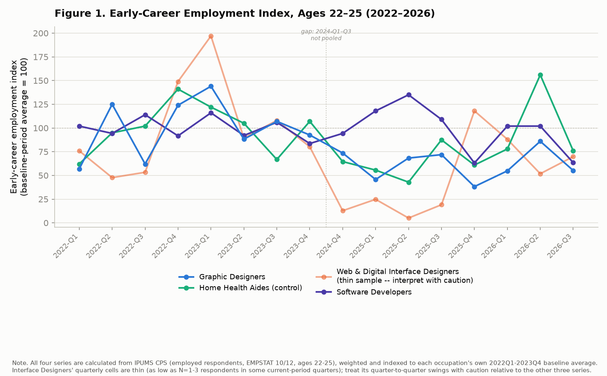
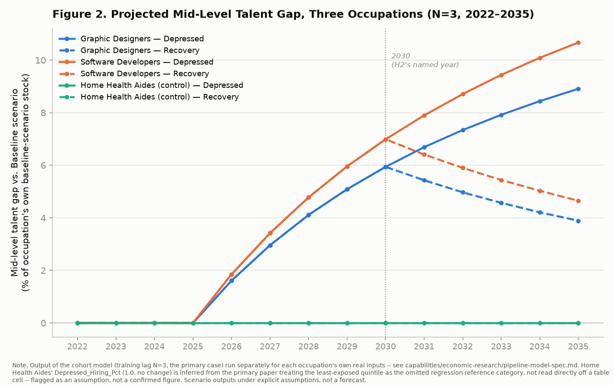

# The Missing Rung: AI and the Entry-Level Tech Pipeline

## The challenge

Generative AI is changing the economics of entry-level work. Tasks that once gave junior designers and engineers their first opportunity to learn—producing design assets, writing boilerplate code, and building first-draft interfaces—can increasingly be automated or completed with AI assistance. The result may be less visible in total employment than in the pipeline into experienced work: if firms can obtain junior-level output without hiring juniors, fewer workers enter the profession and fewer eventually become experienced workers.

The question is therefore not simply whether AI reduces demand for junior workers, but whether **the market will correct the resulting training shortfall before missing junior cohorts become a shortage of experienced talent**.

This paper examines four occupations with different expected AI exposure: Graphic Designers, Software Developers, Web & Digital Interface Designers, and Construction Laborers. Software Developers provide a benchmark; Graphic Designers provide the primary comparison; Interface Designers provide a more augmentation-oriented contrast; and Construction Laborers provide a lower-exposure control. The analysis does not claim that AI caused all observed employment changes.

## The economics

Three economic concepts explain why the entry-level pipeline can weaken.

First, **training creates a positive externality**. A firm bears the cost of developing a junior worker but may not capture the full return if that worker later leaves for another employer. Firms therefore have an incentive to invest less in training than would be optimal for the industry as a whole.

Second, the problem reflects **short-run versus long-run elasticity**. Firms can reduce junior hiring quickly when technology changes, but the supply of experienced workers cannot respond as quickly because experience takes time to develop. A firm can eliminate a junior position today but cannot create an experienced replacement tomorrow.

Third, the **specificity rule** suggests targeting the market failure rather than the technology. If the problem is underinvestment in training, the response should restore investment in early-career development rather than restrict AI adoption.

## Analysis

The first test asks whether the observed early-career employment pattern follows the predicted AI-exposure mechanism.

Using IPUMS Current Population Survey data, I compared employment among 22–25-year-olds in Graphic Designers and Web & Digital Interface Designers between a pooled baseline of 2022 Q1–2023 Q4 and a current period of 2024 Q4–2026 Q3. Graphic Designers declined **38.3%**, while Interface Designers declined **51.3%**. The difference (Graphic Designers minus Interface Designers) was −13.0 percentage points, with a 95% confidence interval of −38.6 to +12.6 points.

This **does not support the original hypothesis** that Graphic Designers would experience the larger decline: the confidence interval includes zero, the point estimate runs opposite the prediction, and the small Interface Designer sample makes the estimate imprecise. The result is therefore **inconclusive rather than evidence against AI disruption generally**.

The Construction Laborers control declined only **1.83%**, consistent with the roughly flat pattern expected of a low-exposure occupation. This result does not point to a broader labor-market or occupation-specific downturn independent of AI exposure.

A same-source CPS check on Software Developers, the occupation most directly cited as the primary study's clearest case of early-career disruption, found only a **1.6%** decline in this pull, compared with roughly **18%** in the primary study's published series over a comparable window. The estimates use different sources and methodologies—CPS survey data versus ADP payroll data—which may contribute to the difference, but this paper does not attempt to reconcile them. The discrepancy is reported rather than smoothed over.

The second test asks a different question: **what happens if reduced junior hiring persists, regardless of exactly how much of the initial decline is attributable to AI?** A cohort model tracks junior hires into the future mid-level workforce. The primary case assumes three years for a junior worker to progress to mid-level, with five years as a sensitivity case. Under the Depressed scenario, junior hiring remains at its current reduced level through 2030; under Recovery, it returns to its pre-2022 trend by 2028.

The timing result supports the second test. Under Depressed, the modeled mid-level shortage begins in **2026** with a three-year transition and **2028** with a five-year transition. Under Recovery, the gap narrows but remains open through 2035.

These figures are **scenario outputs, not forecasts**: even if firms eventually restore junior hiring, new hires cannot immediately become the experienced workers earlier cohorts would have produced.

The first test does not establish that Graphic Designers experienced a larger AI-driven decline. The second test does not establish that Graphic Designers are experiencing the depressed scenario; it takes the broader early-career employment effect identified in the primary study as an input and asks what follows if that effect persists. **The second test evaluates pipeline timing, not the occupation-specific mechanism evaluated by the first.**

## Figure

**Figure 1. Early-career employment index, 2020–2026**

Figure 1 compares early-career employment trajectories across the four occupations. It is descriptive rather than causal: it shows whether occupations experienced similar or different changes among workers ages 22–25 during the study period. The broader primary-study evidence addresses the distinction between early-career and experienced-worker outcomes.

*Note.* All four series are calculated from IPUMS CPS data using the same methodology, weighted and indexed to each occupation's baseline-period average. Interface Designer quarterly samples are thin, so its swings should be interpreted cautiously.

**Figure 2. Projected mid-level talent gap, three occupations, 2022–2035**

*Note.* Output of the cohort model (training lag N=3, the primary case) run separately for each occupation's own real inputs — see `capabilities/economic-research/pipeline-model-spec.md`. Gap is expressed as a percentage of each occupation's own baseline-scenario stock, not raw headcount, since Software Developers' absolute numbers are roughly six times Graphic Designers' and would otherwise dominate the chart. Construction Laborers' `Depressed_Hiring_Pct` (0.982) is set from this paper's own first-test result — a 1.83% weighted CPS/IPUMS early-career decline — the same real-data approach used for the other two occupations.

## Policy recommendation

The case for intervention does not rest on the first test proving that AI caused the Graphic Designer decline. It rests on the broader evidence that AI-exposed occupations have experienced disproportionate early-career employment declines and on the economic logic that firms may underinvest in training when they cannot capture its full return. The recommendation is therefore **conditional**: where AI-driven reductions in junior work create a training shortfall, collective investment can address the market failure more directly than restricting AI adoption.

First, establish a **mandatory training levy** on firms within the affected sector. Contributions would fund shared early-career training and prevent firms from free-riding on other employers' investments.

Second, policymakers should provide the **legal foundation and oversight**, while firms and the sector body determine training priorities and delivery.

Third, complement the levy with **targeted apprenticeship funding or entry-level hiring credits** to reduce the immediate cost and risk of hiring juniors.

Fourth, firms should redesign junior roles around **AI oversight, judgment, and development**, giving early-career workers responsibility for directing and correcting AI-generated work.

The strongest objection is that the market may eventually self-correct—or that the observed decline may not be sufficiently AI-specific to justify intervention. The evidence here cannot rule out the latter. But where AI has genuinely removed training opportunities, waiting for a mid-level shortage to trigger new hiring creates a timing problem: newly hired juniors still require years to become experienced workers.

The goal, therefore, is not to stop the market from adopting AI. It is to **preserve the training function of the first rung while allowing the work on that rung to change**.
